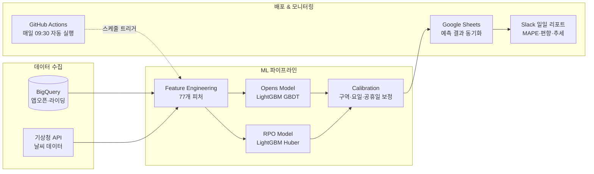
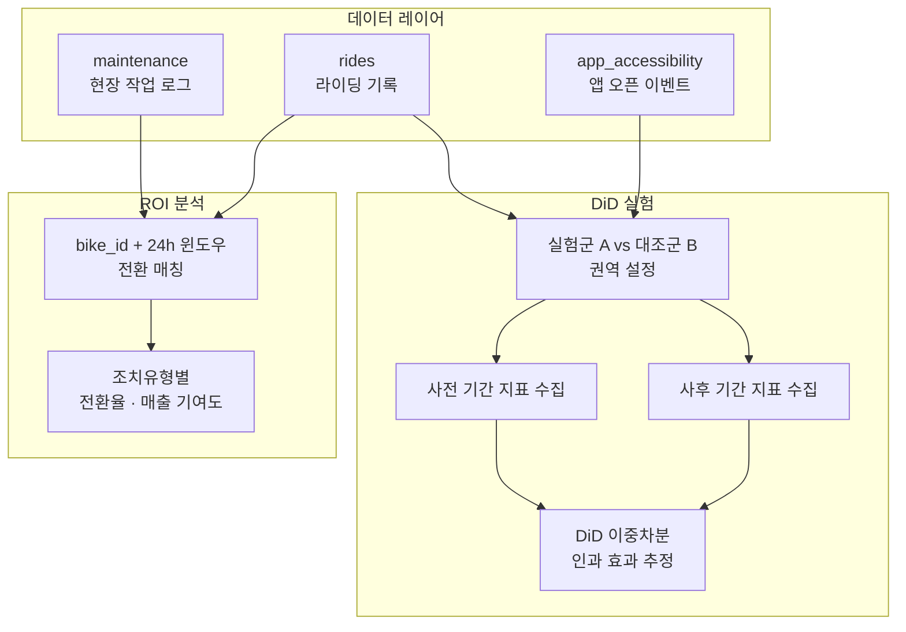
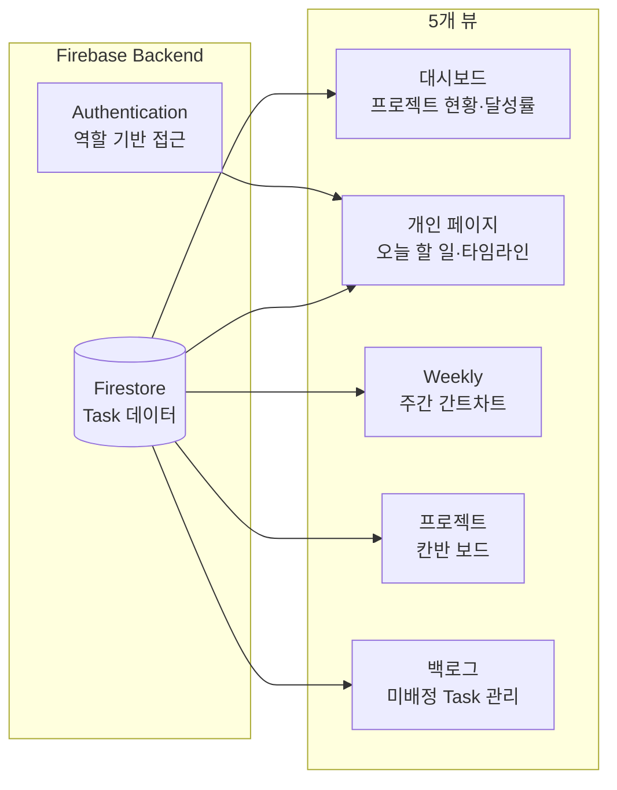
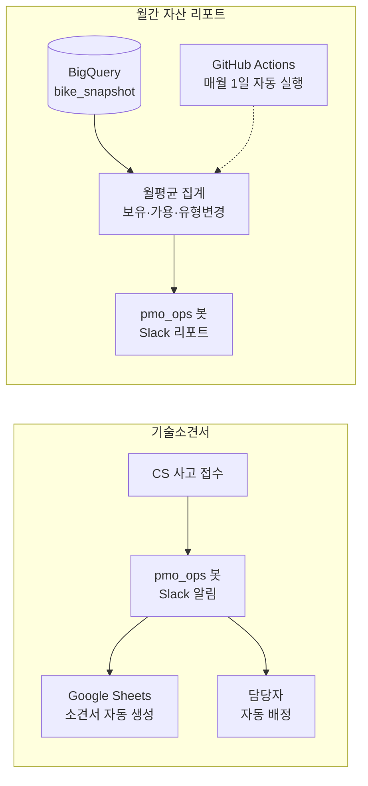

# 박민이 | AI 기반 운영 기획 포트폴리오

> 모빌리티 서비스 런칭부터 약 5년간, 현장의 문제를 데이터로 정의하고 AI/ML로 해결해온 운영 기획자입니다.


---

## 핵심 역량

| ML 예측 모델링 | 데이터 기반 실험 설계 | 업무 자동화 파이프라인 |
|:---:|:---:|:---:|
| LightGBM 앙상블 모델로<br>일별 수요를 예측하고<br>MAPE 11%를 달성 | DiD, ROI 분석 등<br>실험 설계로 현장 작업의<br>효과를 정량적으로 검증 | 19개 자동화 도구를<br>설계·운영하며<br>6개 업무 영역을 커버 |

---

## Projects

### 1. ML 기반 수요 예측 시스템

> 경험적 어림 예측을 ML 모델로 대체하여, 일별 권역·구역 단위 이용량을 자동으로 예측하는 시스템

**Problem**
- 계절성, 날씨, 이벤트 변동을 반영하기 어려운 경험적 수요 예측
- 인력·재배치 스케줄링에 정량적 근거 부재

**Approach**
- 앱 오픈 수 예측과 전환율(RPO) 예측을 분리한 **2-Model Ensemble** 설계
- `predicted_rides = predicted_app_opens × predicted_RPO`
- 77개 피처 엔지니어링: 시계열 rolling, lag, 날씨, 요일, 공휴일, 권역 간 상호작용
- 후처리: RPO Shrinkage, 구역 보정(0.5~1.5), 요일 보정(0.7~1.3), 공휴일 감쇠

**Architecture**



**Results**
- MAPE **11.1%** 달성 (7일 이동평균 기준)
- GitHub Actions 기반 **일일 자동 파이프라인** 운영 중
- Slack 봇으로 매일 자동 성과 리포트 발송 (추세 진단, 보정 알림 포함)

**Screenshot**

<!-- 마스킹 후 아래 경로에 이미지를 추가하세요 -->
<!--  -->

`Python` `LightGBM` `BigQuery` `GitHub Actions` `Google Sheets API` `Slack Webhook`

---

### 2. 현장 작업 ROI 분석 & DiD 실험 설계

> 현장 작업(고장수거, 배터리교체)의 실제 효과를 정량적으로 측정하고, 동선 개선 시범 운영의 인과 효과를 DiD로 검증

**Problem**
- 현장 작업 후 실제로 라이딩이 발생하는지 알 수 없음
- 동선 개선의 효과를 "느낌"이 아닌 데이터로 검증할 방법 필요

**Approach**

*ROI 분석*
- 조치된 bike_id별로 24시간 내 라이딩 발생 여부 추적
- 조치유형(고장수거/배터리교체)별 전환율 및 매출 기여도 산출

*DiD (Difference-in-Differences) 실험*
- 실험군(시범 권역) vs 대조군(유사 권역) 설정
- 개입 전후 지표 변화의 **이중차분** 분석
- 지표: 라이딩 건수, 매출, 현장조치율, 접근성, 전환율

**Architecture**



**Results**
- 조치유형별 24시간 내 전환율 차이 정량화
- DiD를 통해 동선 개선의 순수 효과를 인과적으로 측정
- **실험 기반 의사결정 체계** 구축 → 시범 운영 → 전사 확대 프레임워크 정립

**Screenshot**

<!-- 마스킹 후 아래 경로에 이미지를 추가하세요 -->
<!--  -->
<!--  -->

`BigQuery` `Google Sheets` `DiD` `A/B Test` `ROI Analysis`

---

### 3. 운영팀 Task 보드

> 분산된 팀 업무를 하나의 보드에서 관리하는 프로젝트 매니지먼트 웹앱

**Problem**
- 팀 내 프로젝트·개인 업무가 분산되어 진행률 파악 어려움
- 주간 단위 업무 조율과 우선순위 관리 도구 부재

**Approach**
- Firebase 기반 웹앱으로 5개 뷰를 하나의 인터페이스에 통합
- 역할별 접근 제어 (팀원별 개인 페이지, 관리자 전체 대시보드)
- AI 코칭 기능: 마감 임박 Task 우선순위 자동 안내

**Architecture**



**Results**
- 5개 뷰 통합: 대시보드(달성률), 개인(D-day 관리), Weekly(간트), 칸반, 백로그
- 프로젝트별 진행률 실시간 추적 및 마감 초과 알림
- 팀원 간 업무 가시성 확보

**Screenshot**

<!-- 마스킹 후 아래 경로에 이미지를 추가하세요 -->
<!--  -->
<!--  -->
<!--  -->

`Firebase` `JavaScript` `Firestore` `Authentication`

---

### 4. 기술소견서 & 자산 리포트 자동화

> 사고기기 접수 시 기술소견서를 자동 생성하고, 월별 자산 현황을 자동 집계·리포트하는 파이프라인

**Problem**
- 사고 접수 때마다 기술소견서를 수동 작성 → 반복 작업, 누락 리스크
- 월별 자산 현황(보유·가용·유형변경)을 수동 집계 → 시간 소모

**Approach**

*기술소견서 자동화*
- CS 접수 데이터를 감지하여 Slack으로 사고 알림 발송
- Google Sheets 템플릿에 기기 정보·사고 내용 자동 입력
- 담당자 자동 배정

*월간 자산 리포트*
- BigQuery에서 일별 스냅샷 월평균 집계
- 보유/가용 대수, 가용률, 유형 변경 내역을 자동 산출
- Slack Block Kit으로 리포트 포매팅 후 자동 발송

**Architecture**



**Results**
- 기술소견서 수동 작성 **완전 제거**
- 월간 자산 리포트 **완전 자동화** (매월 1일 자동 실행)
- 가용률 등 핵심 지표 자동 산출 및 팀 공유

**Screenshot**

<!-- 마스킹 후 아래 경로에 이미지를 추가하세요 -->
<!--  -->
<!--  -->

`BigQuery` `Google Sheets API` `Slack Webhook` `Apps Script` `GitHub Actions`

---

### 5. 자동화 카탈로그 & 운영 체계

> 19개 자동화 도구를 체계적으로 관리하고, 비개발자도 접근할 수 있는 문서 체계

**Problem**
- 자동화 도구가 늘어나면서 전체 현황 파악 어려움
- 비개발자 팀원이 각 도구의 용도, 실행 방법, 오류 대응을 알기 어려움

**Approach**
- Google Sheets 기반 카탈로그: 업무 영역 / 도구명 / 설명 / 사용 툴 / 실행 주기 / 상태
- 6개 업무 영역으로 분류: 바이크 정비, 유저 분석, 현장 운영, 프랜차이즈, 수요·재배치, 팀 관리
- 상태 관리(운영중/테스트중)로 라이프사이클 추적

**Coverage**

| 업무 영역 | 자동화 도구 수 | 주요 도구 |
|-----------|:---:|------|
| 바이크 정비 | 3 | 일일 정비 알림, 정비 대시보드, 기술소견서 |
| 유저 분석 | 2 | 유저 패널 대시보드, Amplitude 이벤트 분석 |
| 현장 운영 | 5 | 태스크 관리앱, 자산 추적, 서비스 플로우 시각화 등 |
| 프랜차이즈 | 2 | EBITDA 시뮬레이션, 계약구조 시뮬레이터 |
| 수요·재배치 | 4 | 수요 예측, 날씨 수집, Sheets 동기화, 재배치 알고리즘 |
| 팀 관리 | 3 | 컨디션 트래커, HR 태스크 보드, 센터 지표 개편 |

**Screenshot**

<!-- 마스킹 후 아래 경로에 이미지를 추가하세요 -->
<!--  -->

`Google Sheets` `Documentation` `Process Management`

---

## 전체 시스템 아키텍처

```mermaid
flowchart TB
    subgraph 데이터 소스
        APP[앱 오픈 이벤트]
        RIDE[라이딩 기록]
        SNAP[기기 스냅샷]
        WEATHER[기상청 API]
        CS_DATA[CS 사고 접수]
    end

    subgraph 데이터 레이크
        BQ[(BigQuery)]
    end

    subgraph AI · ML
        FORECAST[수요 예측 모델<br>LightGBM Ensemble]
        ANALYSIS[실험 분석<br>DiD · ROI]
    end

    subgraph 자동화 파이프라인
        PIPELINE[일일 예측 파이프라인]
        TECH_DOC[기술소견서 자동화]
        ASSET[월간 자산 리포트]
    end

    subgraph 아웃풋
        SHEETS[Google Sheets<br>예측 결과 · 분석 데이터]
        SLACK[Slack 봇<br>알림 · 리포트]
        DASH[Streamlit 대시보드<br>실시간 모니터링]
        TASK[Task 보드<br>팀 업무 관리]
    end

    subgraph 인프라
        GA[GitHub Actions<br>스케줄러]
    end

    APP & RIDE & SNAP --> BQ
    WEATHER --> BQ
    CS_DATA --> TECH_DOC

    BQ --> FORECAST
    BQ --> ANALYSIS
    BQ --> ASSET

    FORECAST --> PIPELINE --> SHEETS --> SLACK
    ANALYSIS --> SHEETS
    TECH_DOC --> SLACK
    ASSET --> SLACK

    BQ --> DASH
    GA -.->|매일 09:00| PIPELINE
    GA -.->|매월 1일| ASSET
```

---

## 기술 스택

| 분류 | 기술 |
|------|------|
| **데이터** | BigQuery, Google Sheets API, Amplitude |
| **ML** | LightGBM, scikit-learn, SciPy |
| **대시보드** | Streamlit, Plotly, Folium |
| **자동화** | Slack Bolt, Apps Script, GitHub Actions |
| **AI** | Claude API (Claude Code, Codex) |
| **공간 분석** | H3 Hexagon, Shapely, GeoJSON |
| **인프라** | GitHub Actions (CI/CD), Firebase |

---

## 의사결정 프레임워크

이 플랫폼의 모든 프로젝트는 하나의 목표에 연결됩니다:

```
매출 = 이용 건수 × 건당 매출
     = (앱 오픈 × 접근성 × 전환율) × 건당 매출

비용 = 현장 운영비 (정비 + 재배치 + 배터리)

EBITDA = 매출 - 비용
```

| 레버 | 프로젝트 | 기대 효과 |
|------|---------|----------|
| **접근성 개선** | 수요 예측 → 재배치 최적화 | 앱 오픈 시 100m 내 바이크 확률 증가 |
| **전환율 개선** | ROI 분석 → 품질 우선순위화 | 접근 가능 사용자의 실제 라이딩 비율 증가 |
| **비용 절감** | 동선 최적화, 자동화 | 현장 작업 효율 향상, 수동 작업 제거 |

---

## 스크린샷 추가 가이드

`assets/` 디렉토리에 마스킹된 스크린샷을 추가하면 README에 자동으로 표시됩니다.

| 파일명 | 프로젝트 | 마스킹 대상 |
|--------|---------|------------|
| `demand_forecast_slack_report.png` | 수요 예측 | 실제 이용량 수치, Google Sheets 링크 |
| `roi_analysis.png` | ROI 분석 | bike_id, 지역명, 매출 절대값 |
| `did_experiment.png` | DiD 실험 | 권역명, 매출 절대값, 라이딩 건수 |
| `task_board_dashboard.png` | Task 보드 | 이메일, 팀원 닉네임, 내부 프로젝트 상세 |
| `task_board_kanban.png` | Task 보드 | 동일 |
| `task_board_weekly.png` | Task 보드 | 동일 |
| `tech_report_slack.png` | 기술소견서 | SN, 센터명, 사고 내용, 담당자명, URL |
| `monthly_asset_report.png` | 자산 리포트 | 보유·가용 대수, 테이블명 |
| `automation_catalog.png` | 자동화 카탈로그 | 담당자, GitHub URL, 위탁사명 |

---

> 본 포트폴리오는 실제 운영 환경에서 설계·구축한 시스템을 기반으로 합니다.
> 회사 고유 데이터, 인증 정보, 식별 가능한 정보는 모두 제거 또는 일반화되었습니다.
