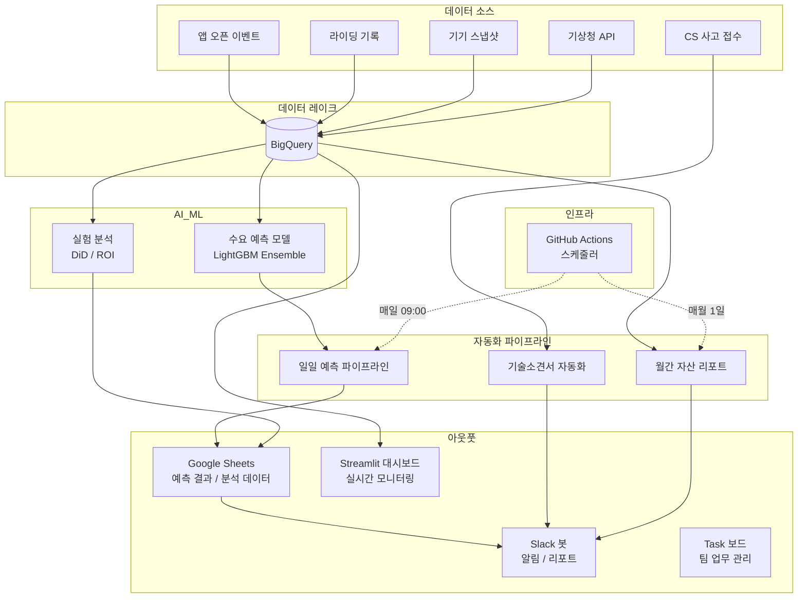

# 박민이 | AI 기반 운영 기획 포트폴리오

> 모빌리티 서비스 런칭부터 약 5년간, 현장의 문제를 데이터로 정의하고 AI/ML로 해결해온 운영 기획자입니다.


---

## 핵심 역량

| ML 예측 모델링 | 데이터 기반 실험 설계 | 업무 자동화 파이프라인 |
|:---:|:---:|:---:|
| LightGBM 앙상블 모델로<br>일별 수요를 예측하고<br>MAPE 11%를 달성 | DiD, ROI 분석 등<br>실험 설계로 현장 작업의<br>효과를 정량적으로 검증 | 19개 자동화 도구를<br>설계·운영하며<br>6개 업무 영역을 커버 |

---

## Projects

| # | 프로젝트 | 한줄 요약 | 핵심 기술 |
|:-:|---------|----------|----------|
| 1 | [**ML 기반 수요 예측 시스템**](./projects/demand-forecast/) | 2-Model Ensemble로 일별 수요 예측, MAPE 11% | LightGBM · BigQuery · GitHub Actions |
| 2 | [**현장 작업 ROI & DiD 실험**](./projects/experiment-did-roi/) | 현장 작업 효과를 ROI·DiD로 정량 검증 | DiD / ROI Analysis · BigQuery |
| 3 | [**운영팀 Task 보드**](./projects/task-board/) | 5개 뷰 통합 프로젝트 매니지먼트 웹앱 | Firebase · Firestore · JS |
| 4 | [**기술소견서 & 자산 리포트 자동화**](./projects/automation-report/) | 사고 접수→소견서 자동 생성, 월간 자산 리포트 | Slack Bot · Apps Script · BigQuery |
| 5 | [**자동화 카탈로그**](./projects/automation-catalog/) | 19개 자동화 도구 체계적 관리 | Google Sheets · Process Mgmt |

> 각 프로젝트를 클릭하면 **Problem → Approach → Architecture → Results** 상세 페이지로 이동합니다.

---

## 전체 시스템 아키텍처



---

## 의사결정 프레임워크

```
매출 = (앱 오픈 × 접근성 × 전환율) × 건당 매출
비용 = 현장 운영비 (정비 + 재배치 + 배터리)
EBITDA = 매출 - 비용
```

| 레버 | 프로젝트 | 기대 효과 |
|------|---------|----------|
| **접근성 개선** | 수요 예측 → 재배치 최적화 | 앱 오픈 시 100m 내 바이크 확률 증가 |
| **전환율 개선** | ROI 분석 → 품질 우선순위화 | 접근 가능 사용자의 실제 라이딩 비율 증가 |
| **비용 절감** | 동선 최적화, 자동화 | 현장 작업 효율 향상, 수동 작업 제거 |

---

## 기술 스택

| 분류 | 기술 |
|------|------|
| **데이터** | BigQuery, Google Sheets API, Amplitude |
| **ML** | LightGBM, scikit-learn, SciPy |
| **대시보드** | Streamlit, Plotly, Folium |
| **자동화** | Slack Bolt, Apps Script, GitHub Actions |
| **AI** | Claude API (Claude Code, Codex) |
| **공간 분석** | H3 Hexagon, Shapely, GeoJSON |
| **인프라** | GitHub Actions (CI/CD), Firebase |

---

> 본 포트폴리오는 실제 운영 환경에서 설계·구축한 시스템을 기반으로 합니다.
> 회사 고유 데이터, 인증 정보, 식별 가능한 정보는 모두 제거 또는 일반화되었습니다.
