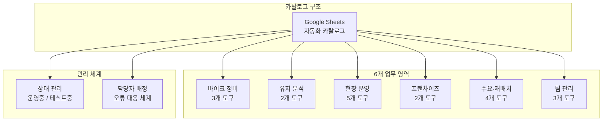

# 자동화 카탈로그 & 운영 체계

> 19개 자동화 도구를 체계적으로 관리하고, 비개발자도 접근할 수 있는 문서 체계

## Problem

- 자동화 도구가 19개로 늘어나면서 전체 현황 파악 어려움
- 비개발자 팀원이 각 도구의 용도, 실행 방법, 오류 시 대응을 알기 어려움
- "이 자동화 뭐였지?", "누가 담당이지?", "어디서 실행하지?" 질문 반복

## Approach

### Google Sheets 기반 카탈로그

비개발자도 접근 가능한 Google Sheets에 전체 자동화 도구를 카탈로그화:

| 컬럼 | 내용 |
|------|------|
| 업무 영역 | 바이크 정비, 유저 분석, 현장 운영, 프랜차이즈, 수요·재배치, 팀 관리 |
| 자동화 이름 | 도구명 |
| 한 줄 설명 | 이게 뭘 하는지 (비개발자용) |
| 사용 툴 | BigQuery, Streamlit, Slack, Apps Script 등 |
| 실행 방식/주기 | 매일 자동, 상시 접속, 수동 실행, 시트 트리거 등 |
| 접속 링크 | 실행할 수 있는 링크/위치 |
| 담당자 | 메인 담당 |
| 오류 시 문의 | 문제 발생 시 연락처 |
| 상태 | 운영중 / 테스트중 |

### 6개 업무 영역별 커버리지

업무 성격별로 분류하여 필요한 도구를 빠르게 찾을 수 있도록 구성:

| 업무 영역 | 도구 수 | 주요 도구 | 사용 기술 |
|-----------|:---:|------|------|
| 바이크 정비 | 3 | 일일 정비 알림, 정비 대시보드, 기술소견서 | BigQuery, Slack, Streamlit, Apps Script |
| 유저 분석 | 2 | 유저 패널 대시보드, Amplitude 이벤트 분석 | Streamlit, Amplitude |
| 현장 운영 | 5 | 태스크 관리앱, 주소 검색, 자산 추적, 서비스 플로우 | Firebase, Apps Script, Streamlit, Google Sheets |
| 프랜차이즈 | 2 | EBITDA 시뮬레이션, 계약구조 시뮬레이터 | BigQuery, HTML |
| 수요·재배치 | 4 | 수요 예측 모델, 날씨 자동 수집, Sheets 동기화, 재배치 | BigQuery, GitHub Actions, Python, H3 |
| 팀 관리 | 3 | 컨디션 트래커, HR 태스크 보드, 센터 지표 개편 | Google Sheets, Firebase |
| **합계** | **19** | | |

## Architecture

## Results

- **19개 자동화** 도구를 6개 업무 영역으로 체계적 분류
- 비개발자 팀원도 각 도구의 용도·실행 방법·담당자를 바로 확인 가능
- 상태 관리(운영중/테스트중)로 도구 라이프사이클 추적
- 새 자동화 추가 시 카탈로그 업데이트 → 팀 전체 동기화

## Tech Stack

`Google Sheets` `Documentation` `Process Management`
