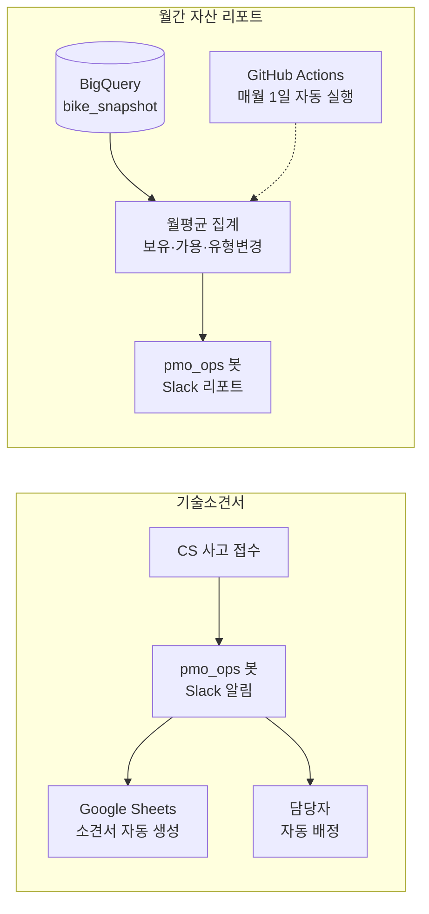
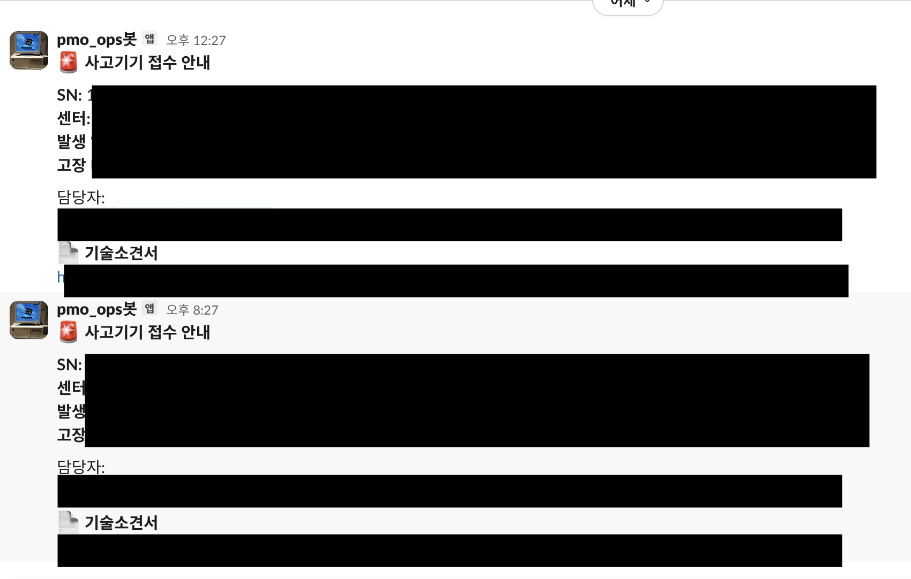
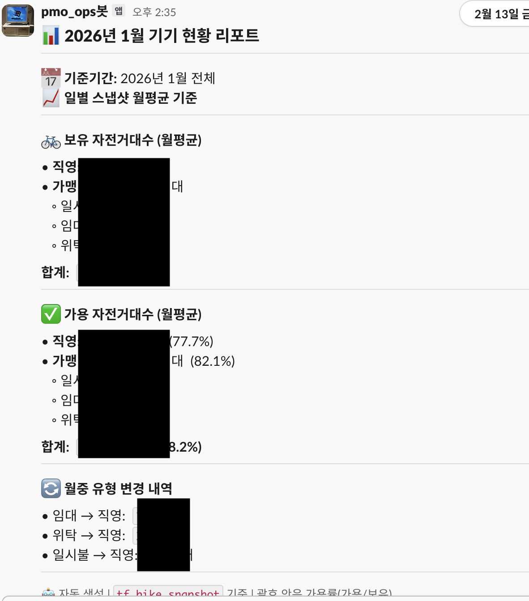

# 기술소견서 & 자산 리포트 자동화

> 사고기기 접수 시 기술소견서를 자동 생성하고, 월별 자산 현황을 자동 집계·리포트하는 파이프라인

## Problem

**기술소견서**
- 사고 접수 때마다 기술소견서를 수동 작성 → 반복 작업, 누락 리스크
- 담당자 배정도 수동 → 대응 지연

**월간 자산 리포트**
- 월별 자산 현황(보유·가용·유형변경)을 수동 집계 → 시간 소모
- 직영/가맹(일시불·임대·위탁) 유형별 분류를 매번 수작업

## Approach

### 기술소견서 자동화

```
CS 사고 접수
  ↓
pmo_ops 봇이 Slack 채널에 접수 알림 발송
  ↓
Google Sheets 기술소견서 템플릿 자동 생성
  (기기 SN, 사고 내용, 접수일자 자동 입력)
  ↓
담당 센터·담당자 자동 배정
```

- 사고 접수 데이터 감지 → 시트 트리거 (5분 간격)
- 기기 정보(SN, 제품명)와 사고 내용을 템플릿에 자동 매핑
- 센터별 담당자 규칙에 따라 Slack 멘션 자동 배정

### 월간 자산 리포트 자동화

```
매월 1일 자동 실행 (GitHub Actions)
  ↓
BigQuery bike_snapshot 테이블 → 일별 스냅샷 월평균 집계
  ↓
보유 대수 (직영 / 가맹: 일시불·임대·위탁)
가용 대수 + 가용률 (%)
월중 유형 변경 내역 (임대→직영, 위탁→직영 등)
  ↓
Slack Block Kit 포매팅 → 자동 발송
```

## Architecture



## Results

**기술소견서**
- 수동 문서 작성 **완전 제거**
- 사고 접수 → 알림 → 소견서 생성 → 담당자 배정까지 **5분 이내 자동 처리**

**월간 자산 리포트**
- **완전 자동화** (매월 1일 09:00 자동 실행)
- 보유/가용 대수, 가용률, 유형 변경 내역 자동 산출
- Slack으로 팀 전체 자동 공유

## Screenshot

<!-- 마스킹 후 아래 경로에 이미지를 추가하세요 -->
<!--  -->
<!--  -->
<!--  -->

## Tech Stack

`BigQuery` `Google Sheets API` `Apps Script` `Slack Webhook` `GitHub Actions`
