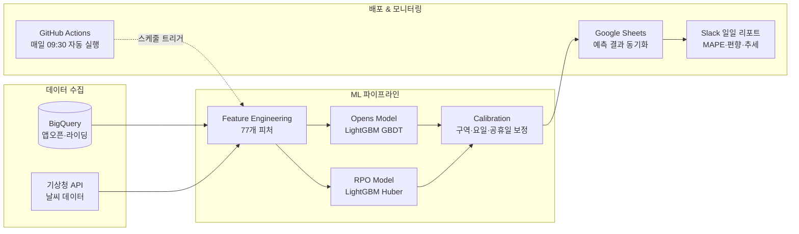
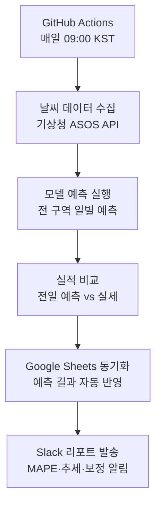
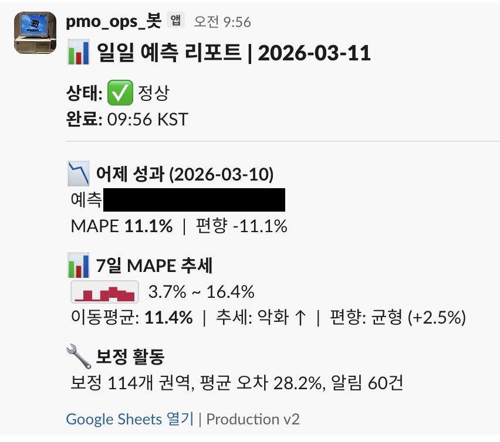

# ML 기반 수요 예측 시스템

> 경험적 어림 예측을 ML 모델로 대체하여, 일별 권역·구역 단위 이용량을 자동으로 예측하는 시스템

## Problem

- 계절성, 날씨, 이벤트 변동을 반영하기 어려운 경험적 수요 예측
- 인력·재배치 스케줄링에 정량적 근거 부재
- 기존 단순 평균 기반 예측은 이벤트·날씨 변동에 취약

## Approach

### 2-Model Ensemble 설계

앱 오픈 수 예측과 전환율(RPO) 예측을 **분리**하여 각각의 특성에 맞는 모델을 독립적으로 학습:

```
predicted_rides = predicted_app_opens × predicted_RPO
```

**왜 분리했는가?**
- 앱 오픈 = 순수 수요 시그널 (공급과 무관)
- RPO(Ride Per Open) = 공급 상태에 영향받는 전환 지표
- 두 지표의 변동 패턴이 다르므로 별도 모델이 정확도 향상

### Feature Engineering (77개 피처)

| 카테고리 | 피처 수 | 예시 |
|---------|:---:|------|
| 시계열 Rolling | 14 | 7일/14일 이동평균, 동요일 평균 |
| Lag | 8 | 1일 전, 7일 전, 월평균 |
| 캘린더 | 12 | 요일, 공휴일, 주요 명절, 월 |
| 날씨 | 10 | 기온, 강수량, 풍속, 습도, 적설 |
| 공간 (이웃·허브) | 15 | 인접 구역 평균, 허브 구역 지표 |
| 인터랙션 | 18 | 비×휴일, 추위×휴일, 월별 인터랙션 |

### 모델

| 모델 | 알고리즘 | Loss | 특징 |
|------|---------|------|------|
| Opens Model | LightGBM GBDT | MSE | 앱 오픈 수 예측, Top 피처: opens_ma7 |
| RPO Model | LightGBM GBDT | Huber | 전환율 예측, 이상치에 강건 |

### 후처리 (Calibration)

1. **RPO Shrinkage**: 예측값을 rolling mean 방향으로 0.6 가중 블렌딩
2. **소규모 구역 클리핑**: opens < 15인 구역은 권역 중앙값 × 1.15로 상한 제한
3. **구역 보정**: 0.5~1.5 범위 보정 계수
4. **요일 보정**: 0.7~1.3 범위 보정 계수
5. **공휴일 감쇠**: 주요 명절 별도 감쇠 적용

## Architecture



### 일일 자동 파이프라인



## Results

- MAPE **11.1%** 달성 (7일 이동평균 기준, 범위 3.7%~16.4%)
- GitHub Actions 기반 **일일 자동 파이프라인** 운영 중
- Slack 봇으로 매일 자동 성과 리포트 발송
  - 추세 진단 (악화/개선/안정)
  - 편향 분석 (과대/과소 예측 방향)
  - 보정 필요 권역 자동 알림 (114개 권역 모니터링)

## Screenshot

### 일일 예측 리포트 - Slack 자동 발송


## Tech Stack

`Python` `LightGBM` `BigQuery` `GitHub Actions` `Google Sheets API` `Slack Webhook` `기상청 ASOS API`
