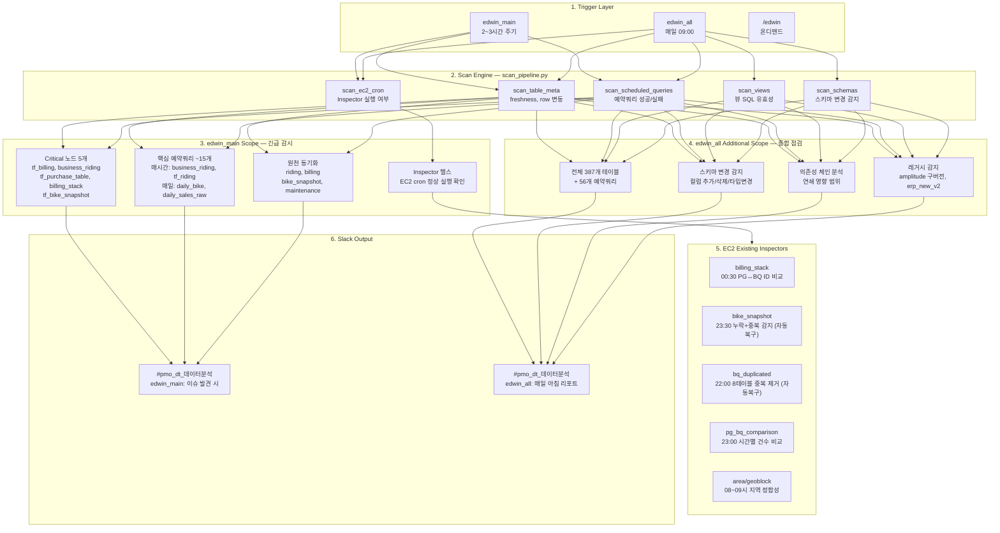

# PROJECT 7. Edwin 파이프라인 모니터링 시스템

> 387개 테이블, 56개 예약쿼리, EC2 Inspector를 6-Layer 구조로 자동 감시하는 데이터 파이프라인 모니터링 시스템

---

## Problem

- BigQuery 예약쿼리 실패, 테이블 freshness 지연 등 **파이프라인 장애를 수동으로 발견**
- EC2에서 돌아가는 Inspector(billing_stack, bike_snapshot 등)가 죽어도 **알 수 없음**
- 스키마 변경(컬럼 추가/삭제/타입변경)이 **하위 테이블에 연쇄 영향**을 미쳐도 사전 감지 불가
- 장애 발생 시 원인 추적에 시간 소요 → 데이터 기반 의사결정 지연

---

## Approach: 6-Layer Architecture



### 핵심 설계 원칙

| 역할 | 시스템 | 책임 |
|------|--------|------|
| **인프라 감시** | Edwin | 돌아가고 있는가? |
| **데이터 정합성** | Inspector | 데이터가 맞는가? |
| **메타 감시** | Edwin → Inspector | Inspector가 살아있는가? |

### Scan Engine 모듈별 커버리지

| 모듈 | 역할 | edwin_main | edwin_all |
|------|------|:---:|:---:|
| scan_table_meta | 테이블 freshness, row 수 변동 | O | O |
| scan_scheduled_queries | 예약쿼리 실행 성공/실패 | O | O |
| scan_ec2_cron | EC2 Inspector 실행 여부 | O | O |
| scan_views | 뷰 SQL 유효성 | - | O |
| scan_schemas | 스키마 변경 감지 | - | O |

### BigQuery 라이브러리 활용 구조

```python
from google.cloud import bigquery

client = bigquery.Client(project="project-id")

# 1. 테이블 메타데이터 스캔 — freshness & row count
def scan_table_meta(table_ids: list[str]) -> list[dict]:
    """INFORMATION_SCHEMA.TABLE_STORAGE로 테이블별 last_modified, row_count 조회"""
    query = """
        SELECT table_name,
               TIMESTAMP_MILLIS(last_modified_time) AS last_modified,
               row_count
        FROM `dataset.__TABLES__`
        WHERE table_id IN UNNEST(@table_ids)
    """
    job_config = bigquery.QueryJobConfig(
        query_parameters=[
            bigquery.ArrayQueryParameter("table_ids", "STRING", table_ids)
        ]
    )
    return [dict(row) for row in client.query(query, job_config=job_config)]

# 2. 예약쿼리 실행 이력 — 스케줄된 쿼리의 성공/실패 확인
from google.cloud import bigquery_datatransfer_v1

transfer_client = bigquery_datatransfer_v1.DataTransferServiceClient()

def scan_scheduled_queries(project: str, region: str = "asia-northeast3") -> list[dict]:
    """전체 예약쿼리의 최근 실행 상태 조회"""
    parent = f"projects/{project}/locations/{region}"
    configs = transfer_client.list_transfer_configs(parent=parent)
    results = []
    for config in configs:
        runs = transfer_client.list_transfer_runs(parent=config.name)
        latest = next(iter(runs), None)
        results.append({
            "name": config.display_name,
            "state": latest.state.name if latest else "NO_RUNS",
            "schedule": config.schedule,
        })
    return results

# 3. 스키마 변경 감지 — 이전 스냅샷과 비교
def scan_schemas(dataset: str, baseline: dict) -> list[dict]:
    """현재 스키마와 baseline 비교 → 컬럼 추가/삭제/타입변경 감지"""
    changes = []
    tables = client.list_tables(dataset)
    for table_ref in tables:
        table = client.get_table(table_ref)
        current = {f.name: f.field_type for f in table.schema}
        prev = baseline.get(table.table_id, {})
        added = set(current) - set(prev)
        removed = set(prev) - set(current)
        type_changed = {
            k for k in set(current) & set(prev) if current[k] != prev[k]
        }
        if added or removed or type_changed:
            changes.append({
                "table": table.table_id,
                "added": list(added),
                "removed": list(removed),
                "type_changed": list(type_changed),
            })
    return changes

# 4. 뷰 SQL 유효성 — dry_run으로 깨진 뷰 감지
def scan_views(dataset: str) -> list[dict]:
    """모든 뷰에 dry_run 실행 → SQL 오류 감지"""
    broken = []
    tables = client.list_tables(dataset)
    for table_ref in tables:
        table = client.get_table(table_ref)
        if table.table_type != "VIEW":
            continue
        job_config = bigquery.QueryJobConfig(dry_run=True, use_query_cache=False)
        try:
            client.query(table.view_query, job_config=job_config)
        except Exception as e:
            broken.append({"view": table.table_id, "error": str(e)})
    return broken
```

---

## Results

- **387개 테이블 + 56개 예약쿼리** 자동 감시 체계 구축
- edwin_main: 2~3시간 주기로 **Critical 노드 장애 즉시 감지**
- EC2 Inspector 생존 감시 → Inspector 장애 시 **자동 알림**
- 스키마 변경 감지 + 의존성 체인 분석 → **연쇄 장애 사전 차단**
- 장애 원인 추적 시간 대폭 단축 → 데이터 신뢰도 향상

---

`BigQuery` `bigquery_datatransfer` `Python` `Slack Bot` `EC2` `Pipeline Monitoring` `GitHub Actions`
