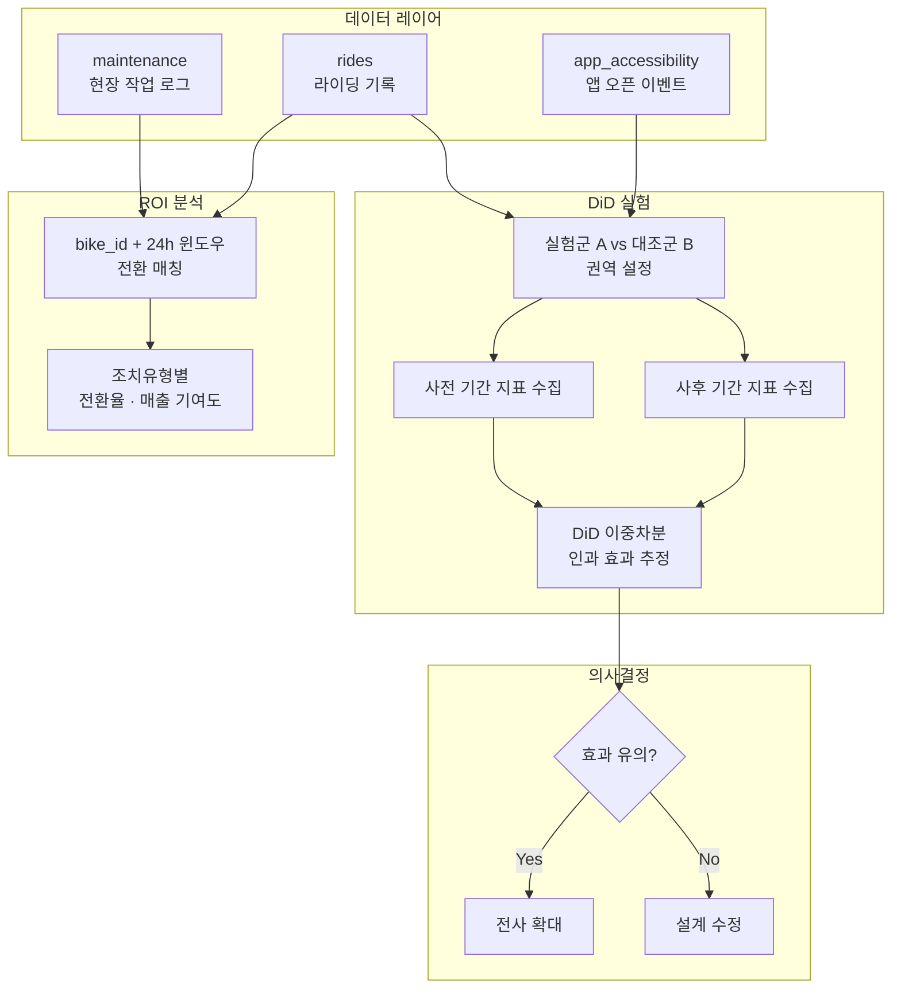

# 현장 작업 ROI 분석 & DiD 실험 설계

> 현장 작업(고장수거, 배터리교체)의 실제 효과를 정량적으로 측정하고, 동선 개선 시범 운영의 인과 효과를 DiD로 검증

## Problem

- 현장 작업(수거, 배터리교체) 후 실제로 라이딩이 발생하는지 알 수 없음
- "정비를 많이 하면 좋겠지"라는 감에 의존 → 작업 우선순위 기준 부재
- 동선 개선 시범 운영의 효과를 "느낌"이 아닌 데이터로 검증할 방법 필요

## Approach

### 1. 현장 작업 ROI 분석

**목표**: 조치유형별로 24시간 내 라이딩 전환 여부를 추적하여 ROI 산출

```
현장 작업 (bike_id, 완료 시각)
    ↓
24시간 내 라이딩 발생 여부 매칭
    ↓
조치유형별 전환율 · 매출 기여도 산출
```

**분석 설계**
- 매칭 키: `bike_id` + 작업 완료 시각 기준 24h 윈도우
- 전환 기준: 해당 bike에서 24시간 내 라이딩 1건 이상 발생
- 비교 축: 조치유형(고장수거 vs 배터리교체), 시간대, 권역

**산출 지표**
| 지표 | 산식 |
|------|------|
| 24h 전환율 | 전환된 조치 건수 / 전체 조치 건수 |
| 건당 매출 기여 | 24h 매출 합계 / 전체 조치 건수 |
| 기여율 | 24h 매출 / 권역 전체 매출 |

### 2. DiD (Difference-in-Differences) 실험

**목표**: 동선 개선의 **순수 인과 효과**를 추정 (단순 전후 비교의 한계 극복)

**실험 설계**
- 실험군 A: 동선 개선 적용 권역
- 대조군 B: 유사 특성의 미적용 권역
- 개입 시점: 시범 운영 시작일

**측정 지표** (5개 동시 추적)
| 지표 | 의미 |
|------|------|
| 라이딩 건수 | 수요 변화 |
| 매출 | 매출 영향 |
| 현장조치율 | 작업 효율 |
| 접근성 | 100m 내 바이크 비율 |
| 전환율 | 접근 → 라이딩 비율 |

**DiD 분석 구조**

```
DiD 효과 = (A_사후 - A_사전) - (B_사후 - B_사전)
```

- 시간에 따른 자연적 변화를 대조군으로 제거
- 순수하게 개입(동선 개선)으로 인한 효과만 추출

## Architecture



## Results

- 조치유형별 24시간 내 전환율 차이 정량화
  - 배터리교체: 전환율 상대적으로 높음 (즉시 가용)
  - 고장수거: 전환 여부에 따라 미전환 건 식별 → 우선순위 재조정 근거
- DiD를 통해 동선 개선의 순수 효과를 인과적으로 측정
- **실험 기반 의사결정 체계** 구축: 시범 운영 → 효과 검증 → 전사 확대 프레임워크 정립

## Screenshot

<!-- 마스킹 후 아래 경로에 이미지를 추가하세요 -->
<!--  -->
<!--  -->

## Tech Stack

`BigQuery` `Google Sheets` `DiD (Difference-in-Differences)` `ROI Analysis` `A/B Test Design`
