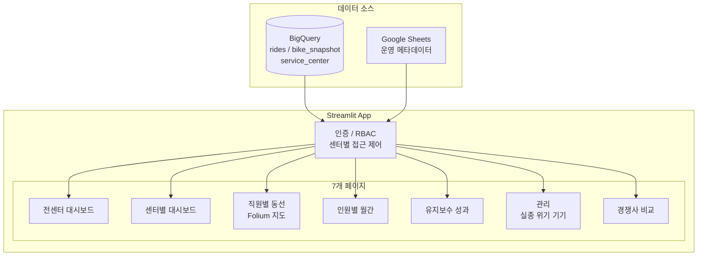
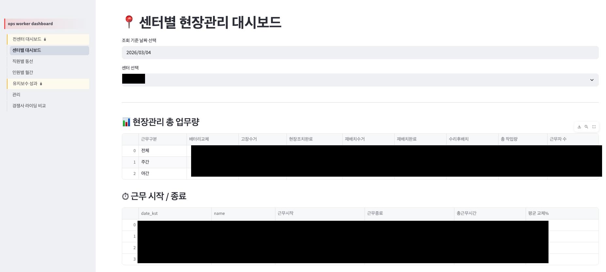
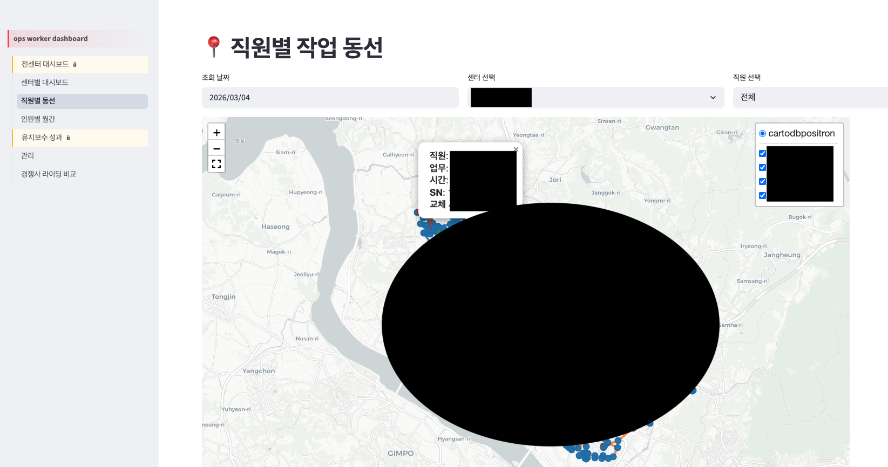

# 운영 대시보드 (Ops Worker Dashboard)

> 센터별 실시간 운영 현황을 모니터링하고, 기기 관리·직원 동선·유지보수 성과를 한 곳에서 추적하는 멀티페이지 대시보드

## Problem

- 센터별 운영 현황(가동률, 수리율, 현장조치율)을 한눈에 파악할 수 없음
- 실종 위기 기기(GPS 미송신 + 라이딩/정비 없음) 관리 체계 부재
- 직원별 동선·작업 효율을 데이터로 비교할 방법 없음
- 경쟁사 대비 라이딩 현황 비교 어려움

## Approach

### Streamlit 멀티페이지 대시보드

역할 기반 접근 제어(RBAC)로 센터 직원, 관리자별 뷰를 분리한 7개 페이지 구성:

| 페이지 | 목적 | 핵심 기능 |
|--------|------|----------|
| **전센터 대시보드** | 전체 운영 현황 | 가동률, 수리율, 현장조치율 KPI |
| **센터별 대시보드** | 센터 상세 지표 | 시간대별 패턴, 센터 간 비교 |
| **직원별 동선** | 작업자 경로 추적 | GPS 기반 Folium 지도 시각화 |
| **인원별 월간** | 개인 성과 통계 | 월간 처리량, 효율 비교 |
| **유지보수 성과** | 정비 KPI | 수리 효율, 비용 분석 |
| **관리** | 기기 관리 | 실종 위기 기기 추적, 필드 인터랙터 해제, 반복 이슈 분석 |
| **경쟁사 비교** | 벤치마킹 | 경쟁사 라이딩 데이터 비교 |

### 실종 위기 기기 관리 (관리 페이지)

```
GPS 7일 미송신 + 60일 라이딩 없음 + 60일 정비 없음
    ↓
실종 위기 기기 자동 필터링
    ↓
상태 관리: 미확인 → 수색중 → 실종
    ↓
1차/2차 수색 체크 + 상태 변경 + CSV 내보내기
```

## Architecture



## Results

- 7개 페이지로 운영 전 영역 모니터링 통합
- 실종 위기 기기 자동 필터링 → 수색 프로세스 체계화 (미확인→수색중→실종)
- 직원별 동선을 GPS 기반으로 시각화 → 작업 효율 비교 근거
- 역할 기반 접근 제어로 센터별 데이터 분리

## Screenshot

### 센터별 현장관리 대시보드 - 업무량 & 근무 현황


### 직원별 작업 동선 - GPS 기반 Folium 지도


## Tech Stack

`Streamlit` `BigQuery` `Folium` `Plotly` `Google Sheets API` `RBAC`
