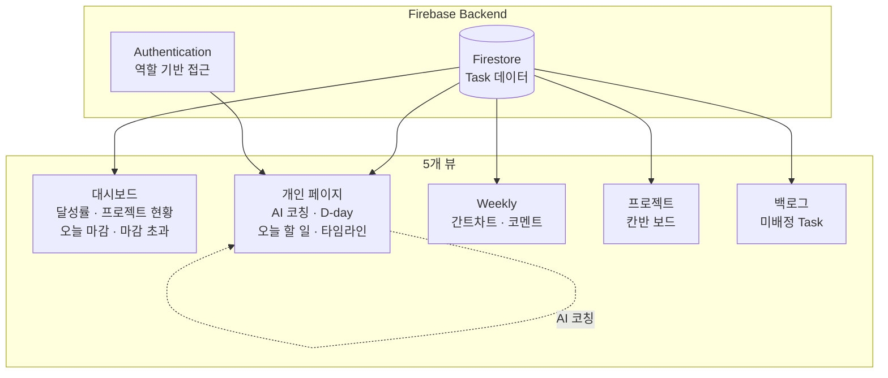
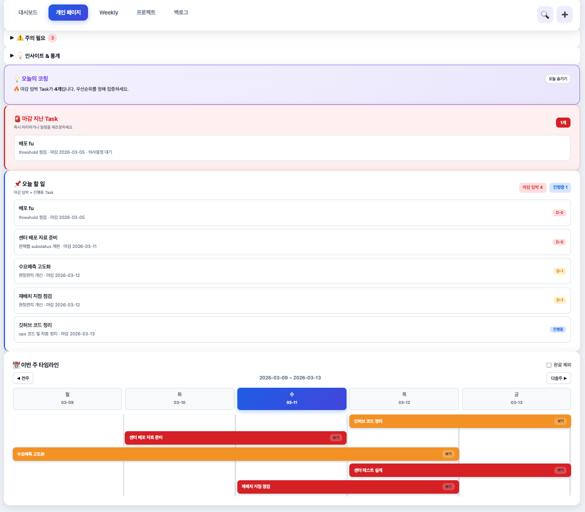

# 운영팀 Task 보드

> 분산된 팀 업무를 하나의 보드에서 관리하는 프로젝트 매니지먼트 웹앱

## Problem

- 팀 내 프로젝트·개인 업무가 여러 도구에 분산되어 진행률 파악 어려움
- 주간 단위 업무 조율과 우선순위 관리 도구 부재
- 프로젝트 단위 진척, 개인 단위 일정, 주간 단위 스케줄을 동시에 볼 수 없음

## Approach

### Firebase 기반 웹앱, 5개 뷰 통합

하나의 데이터소스(Firestore)에서 5가지 관점으로 동일한 Task를 보여주는 구조:

| 뷰 | 목적 | 핵심 기능 |
|----|------|----------|
| **대시보드** | 팀 전체 현황 파악 | 주간 달성률, 프로젝트별 진행률, 오늘 마감 Task, 마감 초과 알림 |
| **개인 페이지** | 개인 업무 관리 | 오늘의 코칭(AI), D-day 표시, 마감 지난 Task 경고, 주간 타임라인 |
| **Weekly** | 주간 스케줄 조율 | 간트차트, 프로젝트별 Task 배치, 팀원별 코멘트 |
| **프로젝트** | 프로젝트 진행 관리 | 칸반 보드 (To do / Doing / Done), 체크리스트, 진행률 |
| **백로그** | 미배정 업무 관리 | 프로젝트 미배정 Task 풀, 프로젝트 이동 기능 |

### AI 코칭 기능

- 마감 임박 Task가 4개 이상일 때 우선순위 정렬 안내
- 마감 지난 Task 자동 경고 및 일정 재조정 제안

### 역할 기반 접근

- 팀원: 개인 페이지 + 본인 Task
- 관리자: 전체 대시보드 + 모든 팀원 현황

## Architecture

## Results

- 5개 뷰 통합으로 팀 업무 **가시성 확보**
- 프로젝트별 진행률 실시간 추적 (완료/진행중/대기 비율)
- 마감 초과 Task 자동 알림 → 일정 관리 개선
- 담당자별 업무 부하 시각화 → 업무 배분 근거

## Screenshot

<!-- 마스킹 후 아래 경로에 이미지를 추가하세요 -->
<!--  -->
<!--  -->
<!--  -->
<!--  -->

## Tech Stack

`Firebase` `Firestore` `Authentication` `JavaScript` `HTML/CSS`
